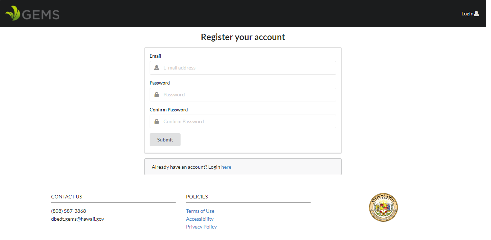
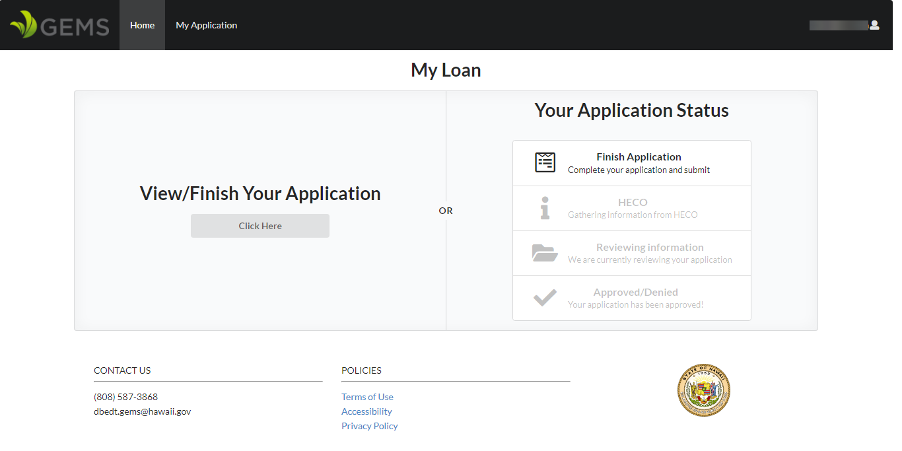

## Overview

green-loan-portal is a web application that we have created for the [GEM$ loan program](https://gems.hawaii.gov/). The application provides improvements to the current process which is done manually and is very prone to errors. As of now, the current process is mainly initiated by filling out a long PDF application that has many sections and can be overwhelming to fill out. Additionally, all the information from the submitted application is also inputted manually into a spreadsheet, so the possibility of errors are much more frequent, as every piece of information is copied over by hand. 

Our solution that we are working toward aims to eliminate the redundancies in the current process by creating a web application that is simple to fill out easy to follow along with. Applicants can create their own accounts, and fill out their application with the web-based forms, and can save their progress in the application to come back to it later. It also creates database entries for each user and records their responses in the forms in the database as well. For the loan processors, different account roles will be created, and they can look up any applicant by querying their information in the database. 

Finally, a key feature that we are working on implementing is to export database entries for each applicant into the original application form for historical documentation purposes. 

Some more improvements include:

* User account creation to create new applications and save their application status
* Monitoring of progress of application status to see what stage of processing it is in
* Friendly web-based form for the GEM$ application
* Database querying of loan applicants for loan processors
* User Roles for all parties involved in the application process
* Automation of key processes to ensure that things are handled/addressed in the quickest way possible

Tracking/progress of project issues can be found on our project boards.

[Milestone 1](https://github.com/orgs/green-loan-portal/projects/1)

[Milestone 2] (https://github.com/orgs/green-loan-portal/projects/2)

## Team Members:

Brody Uehara: Junior at the University of Hawaii at Manoa, primarily worked on front end of green loan portal. My goals to this project is to learn more about web development and grow my programming skills. 

Trey Sumida: My goal for this project is to learn how to develop an application with a group and code with others. I am looking to improve upon my web development skills. I am more comfortable with front-end UI, and have some experience with databases.

Arslan Rakhmankulov: My goals for this project is to obtain mastery of the Meteor technology stack. I primarily worked on the back-end along with some front end relating to application forms.

Ryota Seki: My goals for this project are to get comfortable with using the web application framework Meteor, to learn the different components associated with it (React and Mongo DB), and to learn the process/workflow of working with and contributing to open source projects. I implemented a few features on the front end. 

Wiley Bui: My goals for this project are to work along with others as well as to practice/master the skills that I have learned in this course using JavaScript, React, Meteor, and, especially, MongoDB. I would like to know how the application would come together when it is made and is pushed through production. The skills that I brought to the teams were to add, update, list, and edit the records for the database.

## Installation

First, [install Meteor](https://www.meteor.com/install).

Second, [download a copy of green-loan-portal](https://github.com/green-loan-portal/simple-green-loans). 

Third, cd into the app directory install the required libraries with:

`$ meteor npm install`

Once the libraries are installed, you can run the application by invoking:

`$ meteor npm run start`

The first time you run the app, it will create some default users and data. Here is the output:
```
meteor npm run start              

> meteor-application-template-react@ start /home/ryota/GitHub/simple-green-loans/app
> meteor --no-release-check --settings ../config/settings.development.json

[[[[[ ~/GitHub/simple-green-loans/app ]]]]]   

=> Started proxy.                             
=> Started MongoDB.                           
W20191113-21:37:31.866(-10)? (STDERR) Note: you are using a pure-JavaScript implementation of bcrypt.
W20191113-21:37:31.929(-10)? (STDERR) While this implementation will work correctly, it is known to be
W20191113-21:37:31.931(-10)? (STDERR) approximately three times slower than the native implementation.
W20191113-21:37:31.932(-10)? (STDERR) In order to use the native implementation instead, run
W20191113-21:37:31.933(-10)? (STDERR) 
W20191113-21:37:31.933(-10)? (STDERR)   meteor npm install --save bcrypt
W20191113-21:37:31.934(-10)? (STDERR) 
W20191113-21:37:31.934(-10)? (STDERR) in the root directory of your application.
I20191113-21:37:32.378(-10)? Creating default data.
=> Started your app.
```

**Note regarding bcrypt warning.** You will also get the following message when you run this application:

```
Note: you are using a pure-JavaScript implementation of bcrypt.
While this implementation will work correctly, it is known to be
approximately three times slower than the native implementation.
In order to use the native implementation instead, run

  meteor npm install --save bcrypt

in the root directory of your application.
```

On some operating systems (particularly Windows), installing bcrypt is much more difficult than implied by the above message. Bcrypt is only used in Meteor for password checking, so the performance implications are negligible until your site has very high traffic. You can safely ignore this warning without any problems during initial stages of development.

If all goes well, the template application will appear at http://localhost:3000. You can login using the credentials in [settings.development.json](https://github.com/ics-software-engineering/meteor-application-template-react/blob/master/config/settings.development.json), or else register a new account.

## Accessing the application on the web

http://simple-green-loans.meteorapp.com/#/

## User Interface Demonstration

After you run the appliation, you will be greeted by our homepage:


If you don't have an account with us, you can click "Login" on the uppper right hand corner of the page, and choose "Sign up":



Once you set up an account, you will receive a confirmation email, and will be taken to this page:



On the user login screen, you can either start/resume your GEM$ application, or you can check the progress of your application to see what stage it is processed at. 
